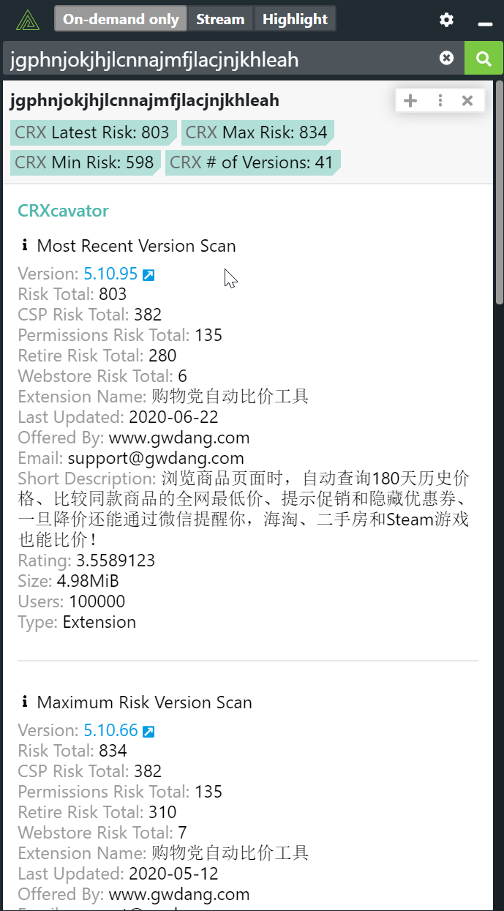
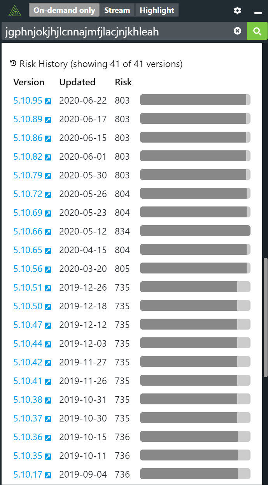

# Polarity CRXcavator Integration

The Polarity CRXcavator integration is an on-demand integration which provides risk information about third-party Chrome extensions based on the extension ID.  The extension ID is a 32 character string made up of alphabetical letters.

The integration will return risk information for the most recent version of the extension as well as information for the version of the extension with the maximum risk, and information for the version of the extension with the minimum risk.  Finally, a risk history table is displayed which lets an analyst view the change in risk over time for the integration.  

|  |  |
|---|--|
|*CRXcavator Showing Most Recent and Max Risk Version Information* | Risk History |

## CRXcavator Options

### Base Url for the CRXcavator REST API

The base URL for the CRXcavator REST API including the schema (i.e., https://).  The default value is `https://api.crxcavator.io/v1`.

### API Key

Valid CRXcavator API Key

## Installation Instructions

Installation instructions for integrations are provided on the [PolarityIO GitHub Page](https://polarityio.github.io/).

## Polarity

Polarity is a memory-augmentation platform that improves and accelerates analyst decision making.  For more information about the Polarity platform please see:

https://polarity.io/
